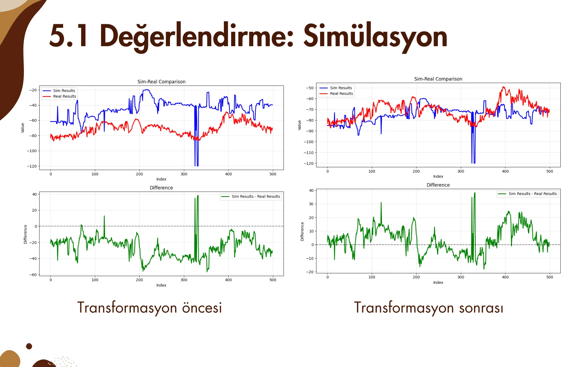
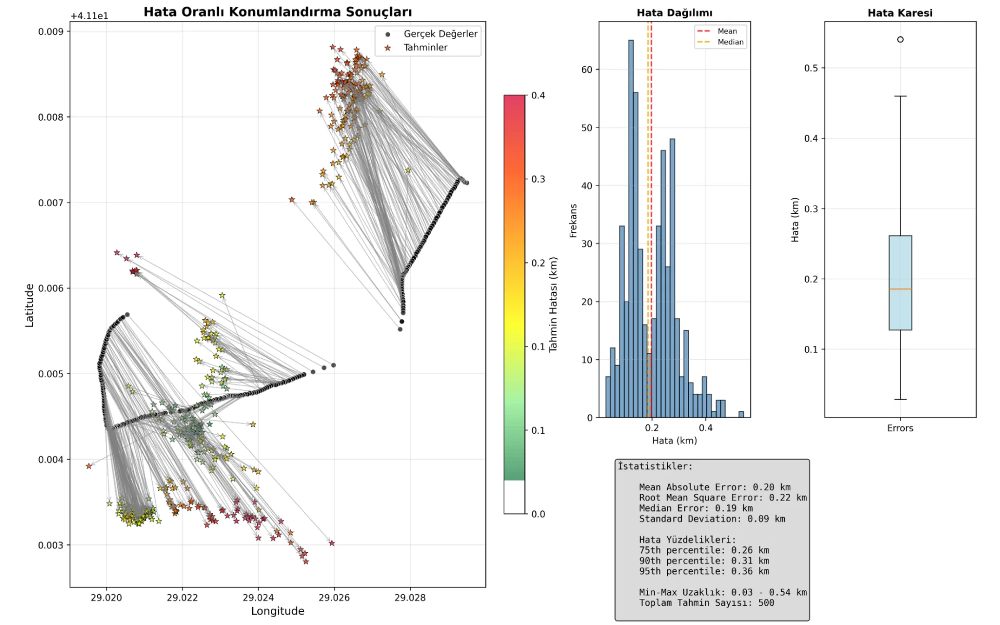

I and my friend Eray attended to a Teknofest competition about triangulating positions from given 5G connection data. During the project, I have learned a lot about 5G terminology, radio waves and location triangulation algorithms.

# Task Description
Using the 5G base station configurations, environmental data, and uplink (UL), downlink (DL), and scanner data from the İTÜ Campus, develop a system that can predict the location of a user equipment (UE) in with an another set of inference-time UL, DL and scanner data.

# TL,DR;
We have simulated the propagation of radio signals with the given base configuration data and have developed a special triangulation algorithm that utilizes the the simulation results as well as the inference-time data.

If you would like to take a look at our final presentation, you may do so via the [public canva link](https://www.canva.com/design/DAGvSi44gCM/z8-QGGzo-xZ1BTzUfVRRGQ/edit?utm_content=DAGvSi44gCM&utm_campaign=designshare&utm_medium=link2&utm_source=sharebutton).

# Detailed Methodology and Journey

What we basically tried to do was using the base station configuration data and İTÜ campus's geometric data, simulate the propagation of radio waves using [SionnaRT](https://nvlabs.github.io/sionna/) (which actually uses [mitsuba](https://mitsuba.readthedocs.io/) at its core).

We initially would like to include environment data but it turns out SionnaRT only supports 2D planes for keeping radio wave strength. Therefore, we opted for using a 2D plane instead of geospatial data of the campus.

Moreover, it was not an easy task to create the scene. We have used Blender and Blender-mitsuba extension for creating it. After fixing up some bad normals we were able to export the scene into a compatible format that mitsuba/SionnaRT can load. The main challenge were the coordinate transformations. We are living in a latitude, longitude, height world while mitsuba scene is in x, y, z. In order to solve this, I have written a small utility that uses `np.linalg.solve` to achieve the transformation matrix and its inverse. This was crucial, as we also have base station locations in terms of lat, lon, height and they too needed to be transformed. We initially thought about including it inside Blender scene, but later on found that it would be a lot harder that way. 

After getting the scene, we put the base stations (and actually noticed flaws in the given configuration) and configured it accordingly. I have written a modular simulation framework so that we can quickly iterate through parameters. 

It was also a critical to test the simulation results. For this, I have written a evaluation pipeline that compares the datapoints given in task with the (continuous) simulation results. Results, well, let's say there were bad. Quite bad. Not only we were getting extreme strengths we also had inconsistencies in the general trend.

Of course my initial attempt was to finetune the parameters and run the simulation again. After multiple failed attempts I've decided to change the approach. I have came up with the idea of *interpolating the simulation results to ground truths*. Our simulation is a 3D data of shape `(num_base_stations, num_cells_y, num_cells_x)`. If we iterate over all base stations and for every base station, if we use the ground truth as the destination of our simulation, we can "pull" the simulation numbers close to real values. 

Well, this too is a problem of its own. First of all, our grid and number of ground truth samples are large. Iterating over every ground truth point and setting its simulation to that version and pulling the neighbouring values takes quite some time. Moreover, probably because of some mistake/misunderstanding in my codes I have failed to achieve desirable results even though my theory is correct and actually could improve the results. Working under stress is another beast, am I right?

I knew simulation results were not in the shape I wanted them to be but nevertheless deadline was approaching and I wanted to got a final prediction for the location no matter how wrong it is. So, I have decided to move onwards.

Next step, we obviously needed to write a triangulation algorithm. For this, we have written a threshold based triangulation algorithm that creates candidate masks within error margins, and also clusters close points into one point in order to reduce the size of candidates. In addition to these, we also assign weights based on signal strength weights and calculate a weighted centroid using them. 

In order to assess the location finding algorithm, I have written a evaluation suite that compares the results with the ground truth and shows useful graphs and statistics about them (like max/min/avg/median, haversine distance etc.). 

After this point, the problem may be in anywhere, heck the only thing working fine is our transformation matrix from worlds coords to sim coords. I obviously tried to improve the simulation; change some base station configurations, linearly interpolate the results so that we don't get high results, correct some here and there as much as I can. I also tried to give interpolation idea a second chance and work on it for a couple of days but no luck. 

As an end resort, in the name of post-processing, I even tried to train a simple NN to give our simulation predictions and get the final results but it proved no use like I expected.

# Final Words
We could have gone for training a simple neural network for this task. I believe almost all of the other competitors tried that. We wanted to go for a simulation not because we can't do NN but to learn how difficult it is to simulate such large environment and breach that sim-to-real gap. Even though we did not get a podium, it was a brilliant experience to be a finalist and *literally* run to our predictions.

What we did wrong? **Simulation**. İTÜ campus is pretty hilly, I believe it was the main reason why our simulation results were sky high.

I still think our reasoning was to the point. However, it is extremely hard to work on a field that is quite deep and come up with a solution in such a short amount of time. This is why I love and hate about competitions where you are given a task and not come up with you own project area. I love it because you get to think on some specific problem and read papers that otherwise you wouldn't even look at. I hate it because it is extremely hard to do this stuff without prior knowledge. Even if you know all the tools you need to complete the task in the end, you still lack necessary theory and literature work.

Nevertheless, thanks Teknofest and Turkcell for coming up with novel competition ideas. Please do keep it up!
