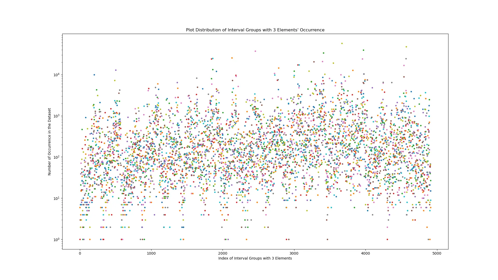
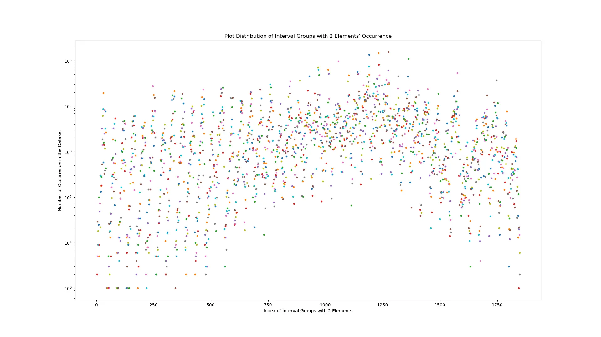

# Description
Ever since I curated my classical guitar dataset, I was curios about the note and interval distribution of it. How many instances of a particular note and interval sequence of N elements there exist?

The idea is fairly simple: I have bunch of MIDI files that I can easily load with [PrettyMIDI](https://craffel.github.io/pretty-midi/) (or [symusic](https://github.com/Yikai-Liao/symusic) as a much faster alternative) and count the occurrences of a set of numbers (intervals) using a sliding window. The thing is, doing this in python, with single core, length of the interval sequence N=5, with 10k MIDI samples with varying lengths takes a long time.

I initially thought it would be better to write this in C++ but because of some time constraints, I went for a jit+multiprocessing python implementation. This project helped me learn quite a lot of multiprocessing, jit compilation with numba and numpy's internals (like how to subclass a numpy array for additional functionalities).

# Some Results
For the following graphs, x axis is the index of the interval group while y axis is the number of occurrences. "Intervals of (-4.0, 4.0)" means, every interval from the list "-4.0, -3.5, -3.0, ..., 3.5, 4.0" is considered while creating interval groups. "n=3" means the length of the group is "3". All graphs are in *logarithmic scale*.

# Code
The code can be found [here](https://github.com/Fansesi/intervalic). Since then, I have became better at structuring my repositories, so excuse my past self :).
