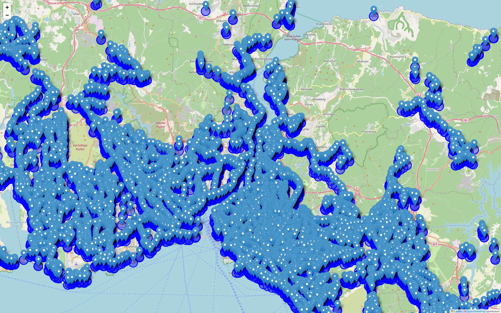

While we were chatting with a friend, he asked 

> "Only using metros and walking maximum of 1 km, how much of İstanbul can you see?". 

I always would liked to work with OpenStreetMap and Overpass API, therefore I rolled up my sleeves and researched how to use a map API. In this post, I would like to share my journey of getting used to gathering, processing and visualizing the map data. 

# Getting the Data
There exist many [processed data providers](https://wiki.openstreetmap.org/wiki/Processed_data_providers). For example, you may use [geofabrik](https://download.geofabrik.de/europe.html) for Europe country specific data or [here](https://download.openstreetmap.fr/extracts/) for other continents as well but I think [Overpass API](https://overpass-turbo.eu/) is just amazing. You only need to get used to its query language. Here is an example:

```
[out:xml]; # 
// Node property search
nwr["operator"~"Metro İstanbul"]({{bbox}});
//nwr["network"~"İstanbul Metrosu"]({{bbox}});
//nwr["operator"~"TCDD "]({{bbox}});
//nwr["railway"~"Ulaştırma "]({{bbox}});
out geom;
```

One aspect I struggled to understand was the data formats. There are many formats to hold map data and you can export to many formats from Overpass API too. Because I would like to process this data on python I also needed a library that can handle such formats. Here is a page that explains different map formats: [HOT Export Tool | Export Formats](https://export.hotosm.org/v3/learn/export_formats).

Another neat thing about the Overpass API is that the search and filtering depends on your bounding box screen (with the help of `({{bbox}})`). So you don't need to process the whole region or the whole country. Just having the map view covering the entire map is sufficient.    

I have chosen .csv because it is quite easy to work with (and I have experience on it). Though another problem I faced was to output csv. For some reason, I had trouble finding the way to output .csv properly in the overpass documentation. After some research, I have come across to the solution:

```
[out:csv (::id, ::lat,::lon, name)];

nwr["operator"="Metro İstanbul"]({{bbox}});

out geom;
```
or for bus stops:
```
[out:csv (::id, ::lat,::lon, name)];

nwr["operator"="İETT"]({{bbox}});
//nwr["network"="İETT"]({{bbox}});
//nwr["highway"="bus_stop"]({{bbox}});

out geom;
```

Additionally, if you would like to filter two keywords at the same time:

```
nwr["highway"="bus_stop"]["network"="İETT"]({{bbox}});
```

## İstanbul Specific Data Collection
İBB has it's own [open data portal](https://data.ibb.gov.tr/) that shares many data including public transportation related ones. There exists [one](https://data.ibb.gov.tr/dataset/rayli-sistem-istasyon-noktalari-verisi) about the location of railed systems (just newly updated on 5 Jan 2025). 

# Choice of Library
Like I mentioned, there are many libraries in python for map visualization or map data processing. A couple of examples:
- [pyosmium](https://docs.osmcode.org/pyosmium/latest/)
	- [Examples](https://github.com/osmcode/pyosmium/tree/master/examples) directory is helpful.
	- Before outputting csv, I was trying to work on OSM. [Filtering an OSM Flie by Tag](https://docs.osmcode.org/pyosmium/latest/cookbooks/Filtering-Data-By-Tags/) from the documentation is a nice resource.
- [plotly](https://plotly.com/python/)
	- It looks fantastic, not only for map visualization but also other graphics, charts and tables. I think it is a great matplotlib alternative.
	- This specific [example](https://plotly.com/python/tile-scatter-maps/) looked promising for me.
- [geopandas](https://geopandas.org/en/stable/)
	- It is an extension of pandas library to allow spatial operations on geometric types.
	- You can easily add a [background](https://geopandas.org/en/stable/gallery/plotting_basemap_background.html) on your plot.
- [folium](https://python-visualization.github.io/folium/latest/)
	- Interactive leaflet in python. Visualizing points or areas is super simple.

# Methodology
The method is straightforward: draw a circle of radius R around each bus/metro station, then calculate the total area covered—accounting for overlapping regions—and subtract it from the total area of Istanbul.

For calculating union, I have used `shapely`'s `unary_union` method which simplified everything a lot.



# Answer to the initial question
Here are total areas of that circles (accounting overlapping):

| Mode  | 100m     | 500m      | 1000m     |
|-------|----------|-----------|-----------|
| Bus   | 185.84 km² | 1513.76 km² | 2439.00 km² |
| Metro | 10.37 km²  | 223.61 km²  | 661.17 km²  |


If we say İstanbul to have an area of 5461 km2 (including forests and other non-city places too), then each of the above values can be expressed as percentages:

| Mode  | 100m     | 500m      | 1000m     |
|-------|----------|-----------|-----------|
| Bus   | 3.40% | 27.7% | 44.66% |
| Metro | 0.18%  | 4.09%  | 12.10%  |


# Final Thoughts
In future work, I intend to exclude non-urban areas from the analysis. Since much of Istanbul’s 5461 km2 total area is uninhabited, recalculating coverage based strictly on populated zones will yield a more accurate representation of transit accessibility.

As always, script can be accessed in [github](https://github.com/Fansesi/transportation-coverage).
